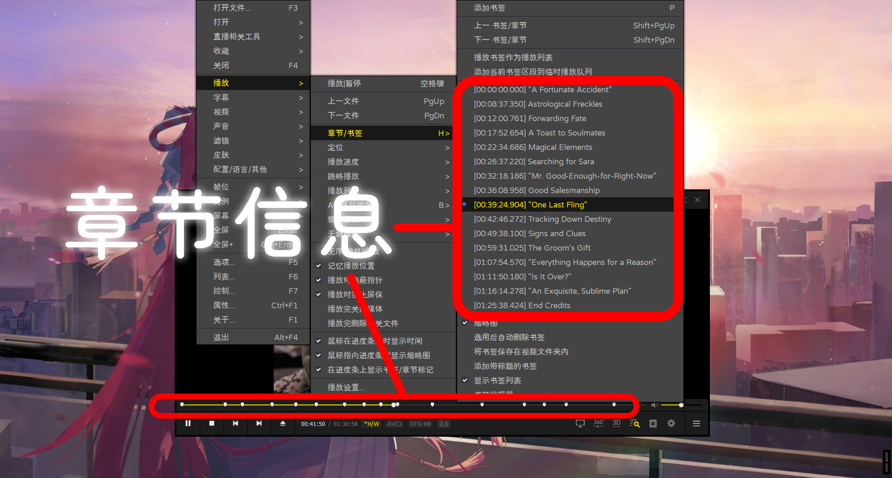

# MKV ChapWeb工具文档
文档语言 [English](readme.md) | [简体中文](readme-CN.md)
## 前言

本年3月初，因个人需求需要生成MKV章节文件，但经过大量查找，发现支持直接编辑章节文件的软件极为稀少，且找到的软件界面陈旧，风格停留在较早时期。鉴于此，本人花费时间使用纯静态前端语言开发了此工具，并将其命名为MKV ChapWeb。

## 简介

MKV ChapWeb是一款专门用于MKV视频格式章节生成的工具，能够帮助用户高效地生成、编辑和管理视频文件中的章节信息。通过直观的网页界面设计，用户可以便捷地设置视频的章节数量、章节名称、开始时间和结束时间等基础参数，并生成符合MKV格式规范的章节标签XML文件，便于在支持MKV视频的播放器中实现精确的章节导航功能。



## 使用方法
此工具的参数设置相对简单，适用于日常使用场景，未包含较为生僻的参数标签。完成章节编辑后请使用相关工具进行混流，例如[MKVToolNix GUI](https://mkvtoolnix.download/)，此工具也提供了更加完善的章节编辑器，对比本项目显得更加强大。
### 工具的界面布局
  - **响应式布局** ：MKV ChapWeb界面采用现代化设计风格，能够自适应PC和移动端设备。该界面支持根据系统设置自动切换浅色模式和深色模式，同时支持中英文双语显示。在加载索引页时，工具会智能检测浏览器的语言设置，并自动跳转到相应语言的页面，避免了因语言不通而需要使用浏览器翻译的问题。
  - **侧边栏参数块** ：打开MKV ChapWeb在线网站或启动MKV ChapWeb离线工具后，主界面的侧边栏会根据默认的章节数量动态生成参数块。每个参数块包含章节名称、开始时间、结束时间等输入项，用户可直接在对应的输入框中填写或修改章节信息。
  - **主控参数区** ：位于页面主体部分，包含视频章节数量、语言标签等关键参数设置项。修改这些参数后，点击相关按钮可触发相应操作，部分操作会动态生成，例如生成章节标签、更新侧边栏参数块等。需要注意的是，修改主控参数区的数据会刷新并清除侧边栏已输入的信息，因此建议用户在设置完主控参数区后再进行下一步操作。
  - **操作按钮** ：“生成章节标签”按钮用于根据当前设置生成XML格式的章节标签文件；“上传XML”和“下载XML”按钮分别用于导入已有的章节信息文件（方便在数据临时导出后再次上传继续编辑）和下载当前生成的章节标签文件。点击“下载XML”按钮后，用户可直接预览生成的XML文件并进行下载操作。

### 章节参数设置
  1. **章节数量调整** ：在主控参数区的“视频章节数量”输入框中输入所需的章节数，然后按下回车键，侧边栏将自动更新为相应数量的章节参数块，用户可在这些参数块中逐一填写各章节的详细信息。
  2. **章节名称填写** ：在每个章节参数块的“章节名称”输入框中，输入该章节的名称或标题。章节名称应简洁明了且具有辨识度，以便在播放设备上清晰地标识章节内容。
  3. **时间参数设置** ：对于“章节开始时间”和“章节结束时间”输入框，用户需按照指定的时间格式（如“时：分：秒”）输入相应的时间值，以准确反映章节在视频中的起止位置，确保在播放时能够正确识别到相应章节。

在本功能部分的逻辑代码中，添加了纠错功能。在输入时间码时，系统仅识别前六位数字作为时间码，且除了标准时间格式所支持的冒号(:)作为分隔符外，还允许使用小数点(.)、减号(-)进行填写。最终输出的时间码会进行格式化处理，即将所有分隔符替换为冒号(:)，并移除多余的数字字符和空格，对于个位数的时间值，会自动补零为两位数（例如：输入2.44-6会格式化输出为02:44:06）。

### 文件操作流程
  - **生成XML文件** ：完成所有章节参数设置后，点击“生成章节标签”按钮，工具将根据当前参数生成符合规范的XML格式章节标签文件，并在页面中显示预览内容。预览页面使用开源的[highlight.js](https://highlightjs.org/)组件库实现XML语法高亮显示，用户可检查文件的准确性和完整性。完成编辑后，若文件无误，用户可双击输出的代码进行一键复制。
  - **下载XML文件** ：若对生成的XML文件检查无误，点击“下载XML”按钮，将文件保存到本地设备，以便后续在视频编辑软件或MKV相关工具中使用，或将其混流封装到MKV视频文件中以实现章节功能。
  - **上传XML文件** ：如需对已有的XML章节文件进行修改或查看，可点击“上传XML”按钮，选择本地的XML文件进行导入。工具会解析文件内容并更新侧边栏的章节参数块，用户可在此基础上进行进一步编辑，此外还可以通过拖拽文件至窗口进行上传。
  
支持解析OGM风格的简易章节文件
```txt
CHAPTER01=00:00:00.000
CHAPTER01NAME=片头
CHAPTER02=00:00:35.789
CHAPTER02NAME=第一部分
CHAPTER03=00:01:23.456
CHAPTER03NAME=第二部分
```

也支持标准MKV章节规范的XML文件
```xml
<?xml version="1.0" encoding="UTF-8"?>
<Chapters>
  <EditionEntry>
    <EditionUID>100480617270839</EditionUID>
    <ChapterAtom>
      <ChapterUID>1</ChapterUID>
      <ChapterTimeStart>00:00:00.000000000</ChapterTimeStart>
      <ChapterDisplay>
        <ChapterString>第1章</ChapterString>
    	<ChapterLanguage>chi</ChapterLanguage>
    	<ChapLanguageIETF>zh</ChapLanguageIETF>
      </ChapterDisplay>
    </ChapterAtom>
    <ChapterAtom>
      <ChapterUID>2</ChapterUID>
      <ChapterTimeStart>00:00:00.000000000</ChapterTimeStart>
      <ChapterDisplay>
        <ChapterString>第2章</ChapterString>
    	<ChapterLanguage>chi</ChapterLanguage>
    	<ChapLanguageIETF>zh</ChapLanguageIETF>
      </ChapterDisplay>
    </ChapterAtom>
  </EditionEntry>
</Chapters>
```

此处的上传操作由浏览器解析数据并在本地进行处理。对于上传解析识别“章节结束时间”的功能是智能化的，即便未勾选主控制块的“是否启用章节结束时间标签”选项，“章节结束时间”也会显示在右侧，但不会输出，因为输出章节结束时间的标签控制由“是否启用章节结束时间标签”的逻辑源码控制，而非上传解析逻辑源码。此功能目前已对其逻辑代码优化，由测试版转为正式版，如仍然发现无法上传文件，可刷新页面重试。并且在上传前，请先设置主参数，否则上传的数据会被刷新和清除。

## 更新记录
### 第二时期版本
  - **v2.3a** ：修复翻译错误与不输出语言标签的问题并且优化了上传解析XML的功能，扩展了不止上传标准XML的章节信息文件，还允许上传OGM风格的简易章节文件(.txt格式的)进行解析为XML标签。修复章节名称无法解析部分常用符号的错误。
  - **v2.2a** ：添加了移除和添加侧边参数块的功能，通过此操作不会重置已有的数据。同时，添加了适配语言以及浅色和深色模式的切换功能（支持在初始化页面时从浏览器检测），进一步优化了界面样式，使其具备更好的响应式布局效果。
  - **v2.1b** ：新增了上传XML文件和下载XML文件的功能，目前上传功能处于beta阶段，可能会出现数据异常或无法上传的情况。
  - **v2.0a** ：对样式和生成逻辑进行了重构，添加了侧边栏，并将所有子参数传入章节参数块。主控参数区添加了动态的章节参数块，并对移动端样式进行了适配优化。
### 第一时期版本
  - **v1.3c** ：添加了结束时间标签的可选状态，默认不启用。同时添加了双击复制所有代码的功能。
  - **v1.2a** ：添加了自定义开始和结束时间的标签。时间输入框默认支持使用小数点和减号作为分隔符进行连接，最后输出时会格式化为标准的时间格式。
  - **v1.1a** ：第二个版本，新增了语言标签和参数ID类型（顺序或随机）的设置功能。
  - **v1.0a** ：初个版本，仅包含生成章节和章节数量两个参数。
