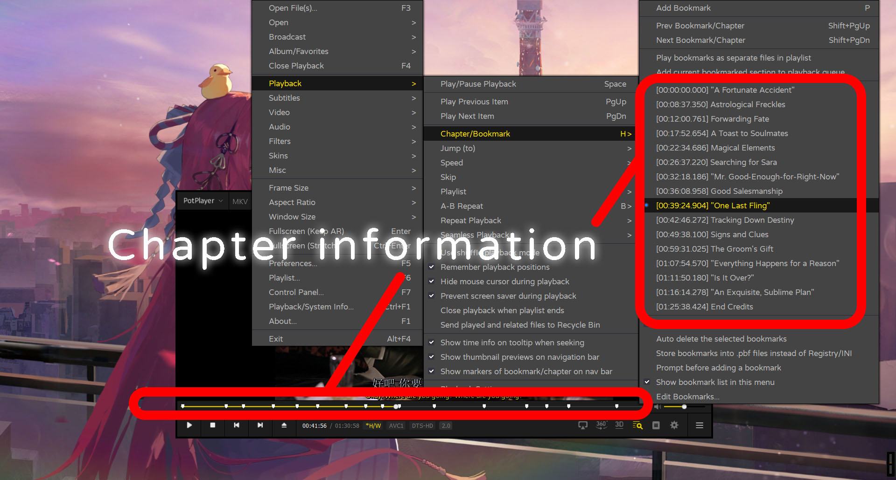

# MKV ChapWeb Tool Documentation  
Documentation Language [English](readme.md) | [简体中文](readme-CN.md)  

## Preface  
In early March 2025, driven by personal requirements to generate MKV chapter files, extensive research revealed a scarcity of software supporting direct chapter editing. Existing tools featured outdated interfaces with design aesthetics trapped in an earlier era. To address this, I developed this tool using pure static frontend languages and named it MKV ChapWeb.  

## Introduction  
MKV ChapWeb is a specialized tool for generating MKV video chapter information, enabling efficient creation, editing, and management of chapter metadata. Through an intuitive web interface, users can easily set chapter quantities, names, start times, and end times, generating XML files compliant with MKV chapter tag specifications for precise chapter navigation in supported players.  

  

## Usage Guide  
This tool focuses on essential parameters for daily use, omitting less common parameter tags. After chapter editing, use muxing tools like [MKVToolNix GUI](https://mkvtoolnix.download/)—which also provides a more comprehensive chapter editor.  

### Interface Layout  
- **Responsive Design**: Modern interface adapts to PC/mobile devices with automatic light/dark mode and bilingual support. Intelligent detection of browser language settings ensures proper localization on page load.  
- **Sidebar Parameter Blocks**: Dynamically generates parameter blocks based on the default chapter count, displaying inputs for names, start/end times.  
- **Master Control Panel**: Contains critical settings like chapter count and language tags. Modifying these parameters and clicking the relevant button triggers corresponding actions (e.g., XML generation, sidebar block refresh). Note: Master settings reset sidebar data upon modification.  
- **Action Buttons**:  
  - "Generate Chapter Tags": Creates XML files with syntax highlighting via the open-source [highlight.js](https://highlightjs.org/) library.  
  - "Upload XML File"/"Download XML File": Import/export chapter files (supports drag-and-drop upload).  

### Chapter Parameter Configuration  
1. **Adjust Chapter Quantity**: Input desired count in the master panel and press Enter to auto-generate sidebar blocks.  
2. **Name Input**: Enter descriptive chapter titles in each block.  
3. **Time Parameter Configuration**:  
   - Input in `hours:minutes:seconds` format.  
   - Support for alternative delimiters (`.`, `-`) which auto-convert to standard `:` format.  
   - Automatic padding for single-digit values (e.g., `2.44-6` → `02:44:06`).  

### File Handling Process  
- **XML Generation**: Click "Generate" to create validated XML with syntax highlighting.  
- **XML Download**: Save generated XML for muxing with MKVToolNix or other editors.  
- **XML Upload**: Import existing XML/OGM-style text files for editing. Note: Master settings must be configured before upload to prevent data loss.  

Support parsing OGM style simple chapter files.
```txt
CHAPTER01=00:00:00.000
CHAPTER01NAME=Start
CHAPTER02=00:00:35.789
CHAPTER02NAME=Chapter 1
CHAPTER03=00:01:23.456
CHAPTER03NAME=The End
```

Also supports standard MKV chapter specification XML files.
```xml
<?xml version="1.0" encoding="UTF-8"?>
<Chapters>
  <EditionEntry>
    <EditionUID>251061650072922</EditionUID>
    <ChapterAtom>
      <ChapterUID>1</ChapterUID>
      <ChapterTimeStart>00:00:00.000000000</ChapterTimeStart>
      <ChapterDisplay>
        <ChapterString>Chapter 1</ChapterString>
    	<ChapterLanguage>eng</ChapterLanguage>
    	<ChapLanguageIETF>en</ChapLanguageIETF>
      </ChapterDisplay>
    </ChapterAtom>
    <ChapterAtom>
      <ChapterUID>2</ChapterUID>
      <ChapterTimeStart>00:00:00.000000000</ChapterTimeStart>
      <ChapterDisplay>
        <ChapterString>Chapter 2</ChapterString>
    	<ChapterLanguage>eng</ChapterLanguage>
    	<ChapLanguageIETF>en</ChapLanguageIETF>
      </ChapterDisplay>
    </ChapterAtom>
  </EditionEntry>
</Chapters>
```

The upload operation on this page is handled locally by the browser, which parses the data. The function for parsing and identifying the "Chapter End Time" during the upload process is designed to be intelligent. Even if the "Enable Chapter End Time Tag" option in the main control block is not checked, the "Chapter End Time" will still be displayed on the right side, but it will not be output. This is because the output of the chapter end - time tag is controlled by the logical source code of the "Enable Chapter End Time Tag" option, not the logical source code of the upload and parsing process.

This function has been optimized in terms of its logical code and is now out of beta and officially released. If you still encounter issues uploading files, you can refresh the page and try again. Additionally, please set the main parameters before uploading; otherwise, the uploaded data will be refreshed and cleared.

## Update History  
### Phase 2 Releases  
- **v2.3a**: Resolved translation inconsistencies and issues with missing language tag output. Enhanced upload support for both standard XML and OGM-style text files. Fixed an error where the chapter title could not parse some commonly used symbols.  
- **v2.2a**: Added dynamic block management (add/remove without data loss), auto-detecting theme/language, and responsive layout improvements.  
- **v2.1b**: Implemented XML import/export (beta). Possible data inconsistencies during initial testing.  
- **v2.0a**: Full rewrite with sidebar interface, dynamic parameter blocks, and mobile optimization.  

### Phase 1 Releases  
- **v1.3c**: Implemented optional status for end time tags and double-click code copying.  
- **v1.2a**: Enabled custom start/end time formatting with automatic delimiter conversion.  
- **v1.1a**: Added language tags and parameter ID type configuration (sequential/random).  
- **v1.0a**: Initial release with basic chapter generation functionality.  